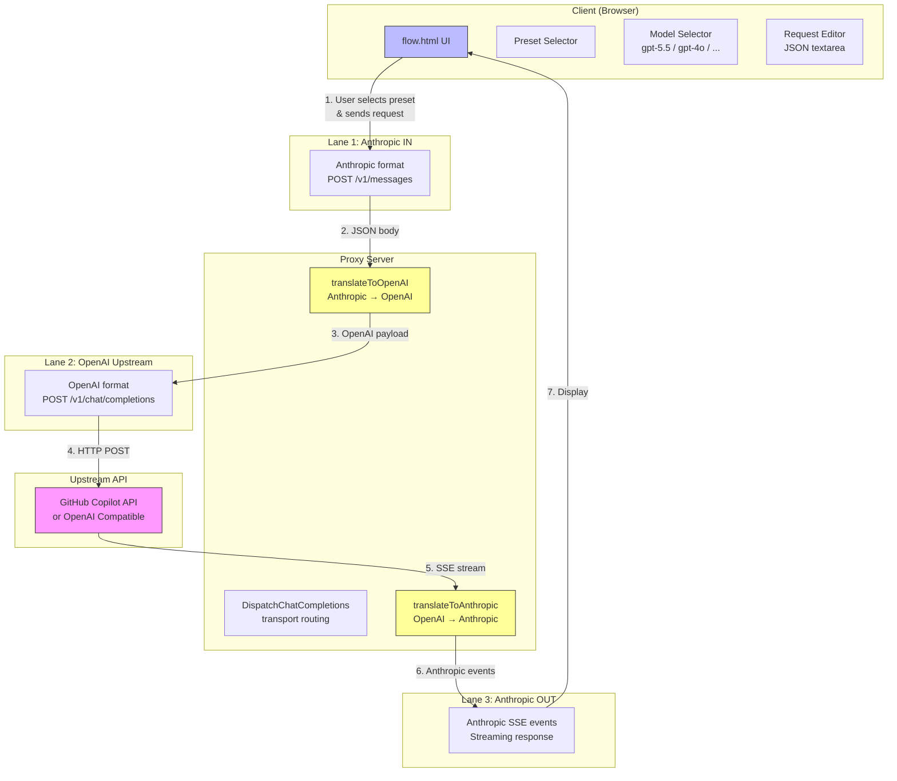
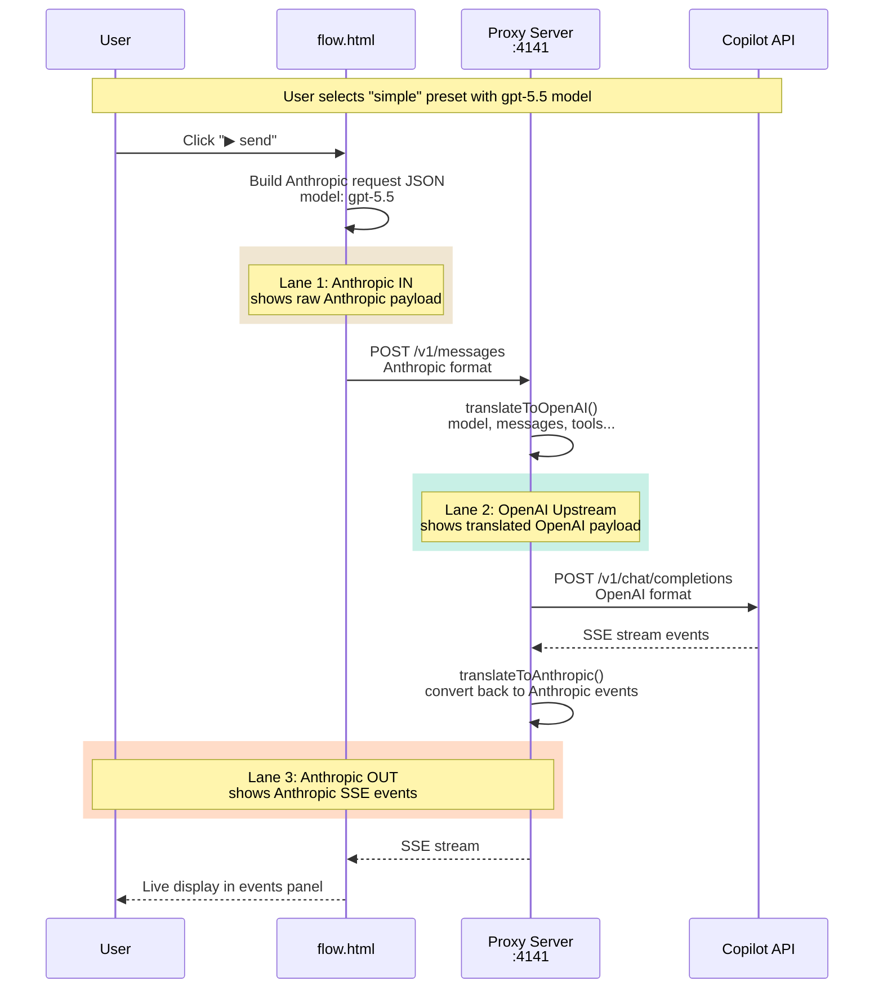
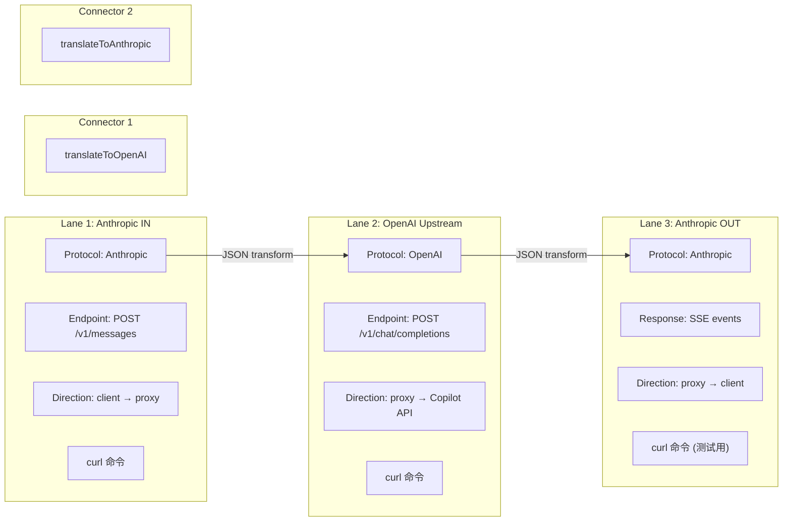
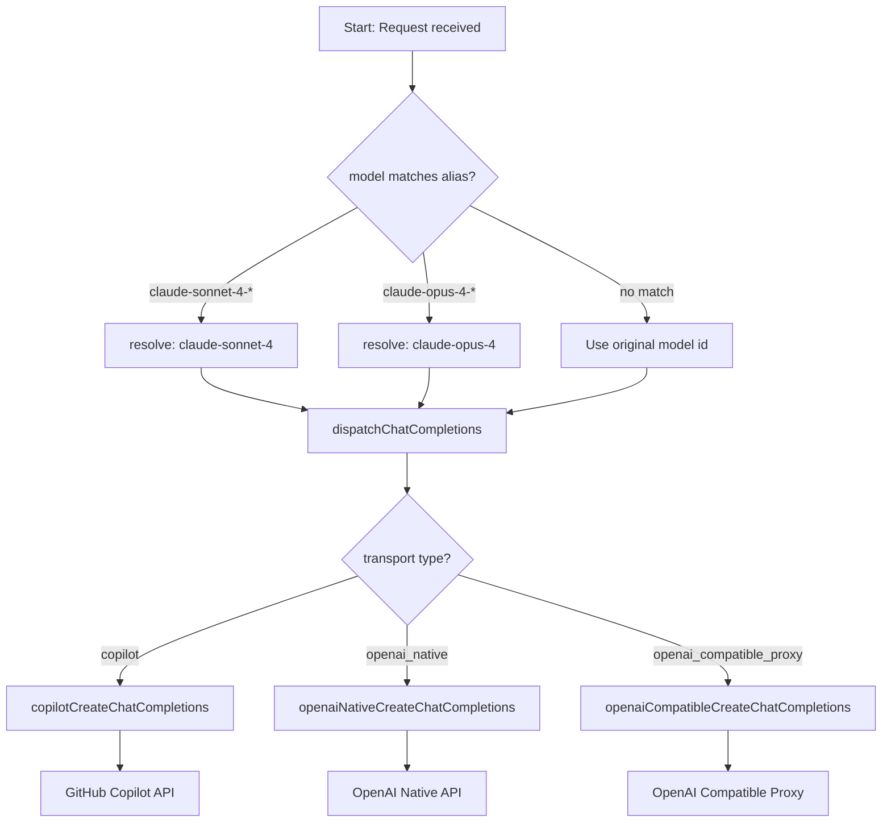

# FLOW - Anthropic ↔ OpenAI 翻译可视化工具

## 概述

`pages/flow.html` 是一个 **Anthropic ↔ OpenAI 协议翻译可视化工具**，用于展示请求从客户端到代理服务器，再到上游 API 的完整转换过程。

主要用途：
- 调试协议转换（Anthropic 格式 ↔ OpenAI 格式）
- 测试模型路由和别名解析
- 监控实时 SSE 事件流
- 分析性能和 token 消耗

---

## 架构图

### 系统架构

---

## 请求流程时序图

---

## UI 组件说明

### 顶部配置栏 (Top Bar)

| 组件 | 功能 | 示例值 |
|------|------|--------|
| **Proxy endpoint** | 代理服务器地址 | `http://localhost:4141/v1/messages` |
| **Target model** | 选择上游模型 | `gpt-5.5`, `gpt-4o-2024-11-20`, `gpt-4o-mini-2024-07-18` |
| **Stream** | 启用/禁用流式响应 | `enabled`, `disabled` |
| **Status Pill** | 显示当前状态 | `idle`, `sending`, `streaming`, `done`, `error` |

### 预设面板 (Presets)

| Preset | 用途 | 关键字段 |
|--------|------|----------|
| `simple` | 基础文本对话 | `claude-sonnet-4-20250514`, 纯文本消息 |
| `tools` | 函数调用 | 包含 `get_weather` tool 定义 |
| `image` | 图片理解 | base64 编码的 PNG 图片块 |
| `thinking` | 扩展思考 | `thinking: {type: "enabled", budget_tokens: 2048}` |
| `alias` | 模型别名解析 | 测试 `claude-sonnet-4-20251022` → `claude-sonnet-4` |

### 三栏 Flow 可视化

### curl 命令显示

每个 Lane 底部都包含完整的 curl 命令，方便直接复制调试：

| Lane | curl 内容 |
|------|----------|
| **Lane 1 (Anthropic IN)** | 发送请求到代理服务器的 curl 命令 |
| **Lane 2 (OpenAI Upstream)** | 代理服务器转发到 Copilot API 的 curl 命令 |
| **Lane 3 (Anthropic OUT)** | 测试代理服务器的示例 curl 命令 |

### Telemetry 遥测栏

| 指标 | 说明 |
|------|------|
| `status` | HTTP 状态码或 error |
| `latency` | 请求总耗时 (ms) |
| `input tokens` | 输入 token 数量 |
| `output tokens` | 输出 token 数量 |
| `cache read` | 缓存命中 token 数 |
| `resolved model` | 解析后的实际模型名 |

---

## 模型路由逻辑

### 当前支持的模型别名

| 别名规则 | 解析结果 | 用途 |
|----------|----------|------|
| `claude-sonnet-4-*` | `claude-sonnet-4` | Claude Code subagent IDs |
| `claude-opus-4-*` | `claude-opus-4` | Claude Code subagent IDs |

---

## 代码对应关系

### 前端 (flow.html) ↔ 后端

| flow.html 函数 | 后端对应文件 | 功能 |
|----------------|-------------|------|
| `resolveModelAlias()` | `src/lib/model-routing.ts` | 模型别名解析 |
| `translateToOpenAI()` | `src/routes/messages/non-stream-translation.ts` | Anthropic → OpenAI 转换 |
| Lane 2 OpenAI payload | `src/services/transport/copilot.ts` | 实际 HTTP 请求发送 |
| SSE events | `src/routes/messages/stream-translation.ts` | 流式事件转换 |
| `translateToAnthropic()` | `src/routes/messages/non-stream-translation.ts` | OpenAI → Anthropic 转换 |

### 传输层路由

| Transport | 后端实现 | 用途 |
|-----------|----------|------|
| `copilot` (默认) | `src/services/transport/copilot.ts` | GitHub Copilot API |
| `openai_native` | `src/services/transport/openai-native.ts` | OpenAI 原生 API |
| `openai_compatible_proxy` | `src/services/transport/openai-compatible.ts` | OpenAI 兼容代理 |

---

## 使用场景

### 1. 调试协议转换

选择 `simple` preset，观察：
- **Lane 1** 显示原始 Anthropic 格式请求
- **Lane 2** 显示转换后的 OpenAI 格式
- **Lane 3** 显示最终的 Anthropic SSE 事件

### 2. 测试模型路由

1. 选择 `alias` preset
2. 查看 Lane 1 中的 `alias` 字段显示解析结果
3. 确认 `claude-sonnet-4-20251022` 被解析为 `claude-sonnet-4`

### 3. 监控实时事件

1. 启用 `stream: enabled`
2. 观察 SSE Event Log 面板
3. 查看 `content_block_delta` 事件逐字显示

### 4. 性能分析

通过 Telemetry 栏查看：
- 请求延迟
- 输入/输出 token 数量
- 缓存命中情况

---

## 常见问题

### Q: 发送请求返回 "model_not_supported" 错误

**原因**: 发送的模型名称不被 Copilot API 支持。

**解决**: 在顶部模型选择器中选择 Copilot 支持的模型（如 `gpt-5.5`），而不是 Claude 模型。

### Q: SSE 事件没有显示

**原因**: `stream` 选项被设置为 `disabled`。

**解决**: 在顶部将 Stream 设置为 `enabled`。

---

## 文件位置

- 前端页面: `pages/flow.html`
- 后端代理: `src/routes/messages/handler.ts`
- 协议转换: `src/routes/messages/non-stream-translation.ts`
- 流式转换: `src/routes/messages/stream-translation.ts`
- 模型路由: `src/lib/model-routing.ts`
